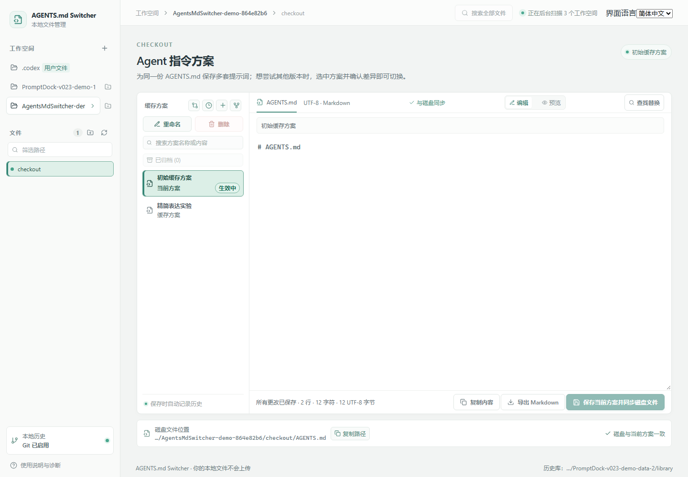
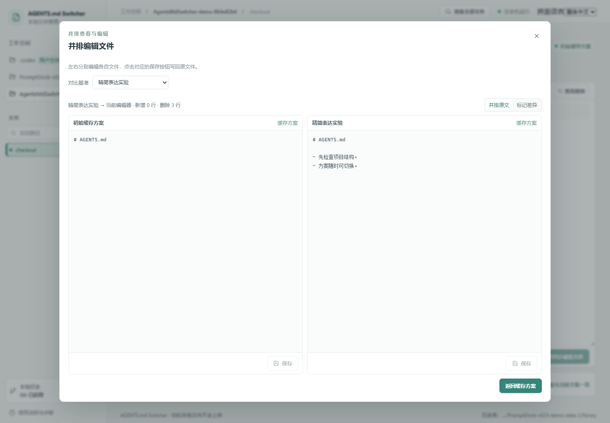
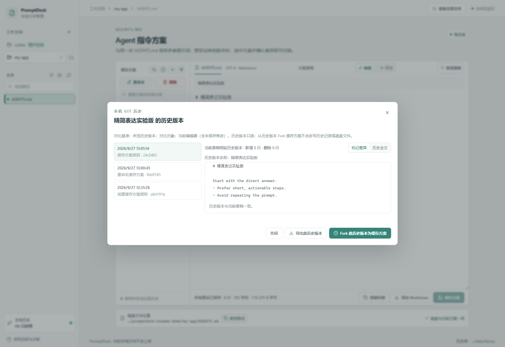
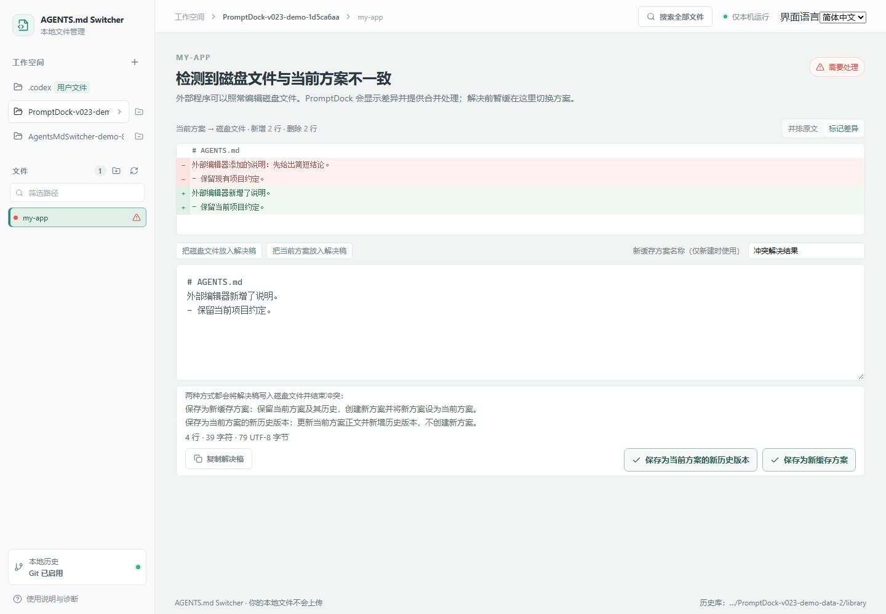

# AGENTS.md Switcher — Multi-project AGENTS.md Plan Switcher

**A lightweight, local-first tool to manage and switch multiple prompt plans across projects' `AGENTS.md` files.** Save prompt variants, experiment, compare, and switch the active plan without manually copying files, renaming `AGENTS.md`, or losing the previous draft. AGENTS.md Switcher keeps a single disk file per path and multiple independent cache plans, each with its own version history. It runs locally; file contents are not uploaded.

**面向多个项目的 `AGENTS.md` 文件，轻量管理并一键切换多套提示词方案。** 不必手动复制文件、反复改名或担心覆盖旧稿。AGENTS.md Switcher 在本机为每个路径保留唯一的磁盘文件，以及多套彼此独立的缓存方案；每个方案有自己的历史版本，选中方案并查看差异后即可切换。文件正文不会上传。

中文名称：**AGENTS.md 多方案切换器**。

The interface supports Simplified Chinese, English, Japanese, and Korean. 界面支持简体中文、英语、日语和韩语。

> **核心模型：一份磁盘文件，多套缓存方案。** 一个目录路径只有一个 agent 实际读取的 `AGENTS.md` 磁盘文件；你可以围绕这份文件保存和试验多套提示词方案。选中要使用的方案后，预览差异并确认即可同步到磁盘文件；无需手工复制旧稿、覆盖或重命名文件。外部程序可以照常改动磁盘文件；AGENTS.md Switcher 检测到磁盘文件与当前方案不一致时，会提示差异并提供合并处理。解决前，AGENTS.md Switcher 会暂缓切换方案。

## 解决的麻烦

- **想试不同版本的提示词：** 围绕同一个 `AGENTS.md` Fork 和编辑多个缓存方案，保留稳定稿与实验稿。
- **不再手工备份和覆盖：** 方案各自保存；选中想用的版本，确认差异后同步到唯一的 `AGENTS.md`。
- **不用复制文件或改文件名：** agent 始终读取同一份磁盘文件，方案切换由 AGENTS.md Switcher 管理。
- **改过的内容可追溯：** 每个缓存方案独立保存历史版本，随时比较或 Fork 旧稿。

## 快速开始

需要 Node.js 20+、pnpm 和 Git。克隆项目后运行：

```sh
pnpm install
pnpm dev
```

打开 <http://127.0.0.1:5173>，点击“浏览”选择目录只会将路径填入输入框；点击“添加并扫描”后才会扫描该目录并导入 `AGENTS.md`。首次使用生产单进程模式：

```sh
pnpm build
pnpm start
```

再打开 <http://127.0.0.1:4317>。GitHub 上的[完整中文指南](#中文使用指南)包含 Windows 启动方式、操作说明和本地数据位置。

## 用一个例子理解多方案切换

假设你想调整 `my-app/AGENTS.md` 的提示词语气和约束。先保留现在可用的“稳定版”，再 Fork 一份“精简表达实验版”修改。比较后觉得实验版不合适，就切回“稳定版”；想继续探索，再 Fork 新方案。每个**缓存方案**都独立保存，编辑保存会记录自己的**历史版本**。不必把文件改名、手工复制旧内容，或担心新稿覆盖后找不回旧稿。

Fork 会直接复制当前选中的缓存方案，并立即打开副本供编辑；不需要先选文件夹，也不会改动来源方案或磁盘文件。并排对比也支持在两侧分别编辑和保存：方案侧保存为该方案的新历史版本，磁盘侧保存到实际 `AGENTS.md`；若两者因此不一致，界面会提示并引导处理。

| 名称     | 表示什么                                             | 例子                          |
| -------- | ---------------------------------------------------- | ----------------------------- |
| 磁盘文件 | 目标路径上真实存在、agent 实际读取的唯一文件         | `my-app/AGENTS.md`            |
| 缓存方案 | 同一份指令文件的独立内容版本，可编辑、归档和快速切换 | “稳定版”“精简表达实验版”      |
| 历史版本 | 某个缓存方案保存时留下的只读快照                     | “稳定版”的上一次保存          |
| 当前方案 | 当前与磁盘文件同步的方案                             | 切换后写入 `AGENTS.md` 的方案 |



Fork 按钮会直接复制当前选中的缓存方案，并自动打开新方案供编辑。选择目录只会回填路径；提交“添加并扫描”后才会扫描工作空间。

### 并排编辑与分别保存

并排窗口适配当前屏幕高度，两侧文档各自滚动、可编辑。左侧保存到当前缓存方案并生成历史版本；右侧保存到所选缓存方案，或直接保存到磁盘文件。磁盘文件保存后如果与当前方案不一致，AGENTS.md Switcher 会提示冲突，用户仍可照常使用其他外部编辑器。



### 历史版本与差异

每个缓存方案都有独立历史，可查看保存时间、方案名称和正文差异。历史面板提供两个并列操作：Fork 所选历史为新缓存方案；或“用此版本恢复当前方案”，以所选正文保存为当前方案的新历史版本，不改写旧历史。若当前方案正在生效，恢复也会同步磁盘文件。只浏览历史不会修改任何内容。



### 外部修改与冲突处理

agent 和其他编辑器可以照常改动磁盘文件。AGENTS.md Switcher 检测到磁盘文件与当前方案不一致时，会提示差异并提供解决方式；你可以对照两边内容形成合并稿。解决前，AGENTS.md Switcher 只会暂缓通过它切换缓存方案，不会限制外部程序读写磁盘文件。

合并后有两种保存方式：**保存为新缓存方案**会保留当前方案及其全部历史，另建一个方案并将它设为当前方案；**保存为当前方案的新历史版本**会更新当前方案正文并增加一条历史记录，不会新建方案。两种方式都会把解决稿写入磁盘文件，使磁盘文件与当前方案重新一致。

- 外部修改只是临时参考，或你想保留原方案作对照：选“保存为新缓存方案”，例如命名为“合并外部修改”。原当前方案和它的历史都保留。
- 外部修改确认要纳入当前方案：选“保存为当前方案的新历史版本”。当前方案名称不变，正文更新，历史中新增本次合并前的时间线记录；不会多出一个方案。



## 中文使用指南

AGENTS.md Switcher 在本机运行：浏览器呈现界面，Node 服务负责扫描和写入工作空间，本地 Git 记录方案历史。它不会将文件正文上传到云端。

## 运行

要求 Node.js 20+、pnpm 和可从终端调用的 Git（历史版本使用本地 Git 保存）。在项目目录执行：

```powershell
pnpm install
pnpm dev
```

开发页面位于 `http://127.0.0.1:5173`，本地 API 位于 `http://127.0.0.1:4317`。日常单进程模式：

```powershell
pnpm build
pnpm start
```

然后打开 `http://127.0.0.1:4317`。服务只监听本机回环地址；停止终端中的进程即可结束服务，不安装后台守护进程。

Windows 可双击项目目录中的 `启动 AGENTS.md Switcher.cmd`：脚本先构建，再启动服务并打开默认浏览器。关闭启动窗口会结束服务。

## 真实浏览器验收

首次运行安装 Playwright Chromium：

```powershell
pnpm exec playwright install chromium
```

随后执行 `pnpm test:e2e`。验收会构建生产前端、启动本地 Node 服务并操作真实浏览器；用户文件、工作空间和应用数据都放在系统临时目录，结束后自动清理。

## 使用说明

1. Codex 用户文件作为普通路径自动添加并排在工作空间列表顶部；默认位置是 `CODEX_HOME/AGENTS.md`，未设置 `CODEX_HOME` 时是 `~/.codex/AGENTS.md`。
2. 添加工作空间时可用系统文件夹选择器，也可输入本机绝对目录路径。服务递归扫描其中的 `AGENTS.md`；之后可手动重扫，每次打开或重新加载文件管理也会重扫所有已登记路径。打开时先显示本地保存的工作空间与文件，再在后台重扫并更新列表；扫描期间顶部状态提示显示进度状态。扫描不跟随符号链接。同名工作空间会附带父路径缩写，避免把不同目录误认成同一路径。有未保存草稿时，手动重扫会先询问，因为扫描可能发现冲突并切换到解决页；取消不会发起扫描，确认后若发生冲突，可将草稿放入解决稿继续合并。已编辑的冲突解决稿也会在重扫前提示；确认重扫后解决稿保留，冲突两侧刷新，如需使用新磁盘文件内容可明确载入解决稿。切换工作空间或文件路径、添加并切换工作空间、移除当前工作空间时，未保存的方案（名称或正文）或冲突解决稿（方案名称或正文）也会先询问；取消保留当前编辑位置和草稿，确认后离开即丢弃。
   工作空间行末的移除按钮只取消路径登记，不删除磁盘文件、缓存方案或历史版本；之后重新添加相同路径即可继续管理。自动登记的用户文件路径不能移除。
3. 发现磁盘文件时，会将其内容导入为首个缓存方案并设为当前方案。没有磁盘文件的目录不会自动创建缓存方案；使用“初始化 AGENTS.md”明确创建磁盘文件和首个缓存方案，并设为当前方案。
4. 新建缓存方案可复制编辑器当前内容（包括未保存修改），也可从此路径的任一已保存方案 Fork 一份；弹窗可展开只读预览来源正文。若当前编辑器有未保存修改，从已保存方案 Fork 会保留原编辑器和草稿，新方案加入列表但不抢占编辑位置。也可以从本机 `.md`／`.markdown` 文件 Fork 一个缓存方案（未设为当前方案）。Fork 不会修改来源文件或磁盘文件。缓存方案可单独编辑和保存；每次保存都会为该方案生成一个历史版本并记入本地 Git。保存时服务端会核对页面打开时的方案名称和正文；如果另一个窗口已经保存了新内容，过期保存会被拒绝，当前草稿保留，可用“新建缓存方案”另存。保存当前方案时同时更新工作空间中的磁盘文件；当前方案有未保存修改时，编辑器会显示本次同步对磁盘文件新增和删除的行数。
   切换当前方案前会先检查最新磁盘文件状态，再显示所选缓存方案与磁盘文件的逐行差异及增删行数；发现外部修改会先进入冲突处理。只有确认后才写入磁盘文件，服务端也会在确认时再次检查。取消预览不改动文件或当前方案。
5. 磁盘文件与当前方案不一致时显示冲突，并阻止在 AGENTS.md Switcher 内切换；外部程序仍可照常改磁盘文件。冲突页默认标出从当前方案到磁盘文件的逐行新增和删除，也可并排查看原文。可将磁盘文件、当前方案或未保存草稿放入解决稿再手动合并。合并后有两种保存方式：**保存为新缓存方案**会保留当前方案及其历史，另建方案并将它设为当前方案；**保存为当前方案的新历史版本**会更新当前方案正文并增加历史记录，不新建方案。两种方式都会将解决稿写入磁盘文件，并恢复当前方案与磁盘文件的一致。
6. 每次保存方案都会为该方案生成一个历史版本，包括只改方案名称的保存。历史版本可逐行比较正文，也能查看当时的方案名称。可直接导出选中的历史版本为 Markdown，也可 Fork 为新缓存方案，或“用此版本恢复当前方案”。恢复会以所选正文新增一条历史记录；已有历史不会被改写。若当前方案正在生效，恢复会同步磁盘文件。只浏览历史不会修改方案或磁盘文件。
7. 其他缓存方案可与磁盘文件或其他缓存方案比较；对比基准下拉框按“磁盘”“缓存方案”“已归档”分组。并排编辑时，左右两侧均可直接修改原文，各自的“保存”按钮写回对应缓存方案或磁盘文件。
8. 编辑器可在编辑和 Markdown 预览间切换；预览随当前草稿即时更新，支持 GFM 表格和任务列表，不会保存内容。原始 HTML 不渲染，图片链接显示占位文字而不发起网络请求。方案编辑区和冲突解决稿都会实时显示当前草稿的行数、Unicode 码点数和 UTF-8 字节数；空内容计一行，末尾换行后的空行也计入，帮助发现文件体量变化。
9. 缓存方案列表可按名称或正文搜索；搜索只隐藏暂时不匹配的方案，不会切换或删除方案。列表上方可重命名或删除选中的缓存方案；重命名会记入本机历史，不更改正文，当前方案不可删除。删除会将方案从列表和搜索结果中移除，旧的历史版本仍保留在本机 Git 中。同一路径存在同名方案时，列表会附加各自 ID 前 7 位，方便区分并选择准确方案。
10. “复制内容”会将当前编辑器正文（包括未保存修改）复制到系统剪贴板，方便直接粘贴到其他工具；复制成功后按钮短暂显示“已复制”。冲突页的“复制解决稿”会复制未保存的合并文本。磁盘文件信息卡片中的“复制路径”会复制完整 `AGENTS.md` 绝对路径。“导出 Markdown”会下载当前编辑器内容。这些操作都不会改变缓存方案、历史版本或磁盘文件。
11. 在方案名称或正文编辑框按 `Ctrl+S`（macOS 为 `⌘S`）保存当前方案，并生成历史版本；冲突解决稿须明确选择“保存为新缓存方案”或“保存为当前方案的新历史版本”，二者都会同步磁盘文件，但只前者新建方案。方案有未保存修改时可“还原已保存内容”，经确认后恢复此方案最近保存的名称和正文，不改磁盘或历史。任一弹窗都可按 `Esc` 关闭，效果等同于关闭按钮，不会保存或提交内容。刷新或关闭页面时，浏览器会对未保存方案或冲突解决稿显示离开确认；取消离开会保留当前草稿。
12. 非当前方案可归档以收起试验方案；归档只改变方案的本地管理状态并记入历史，不删除正文、历史版本或磁盘文件。可在“已归档”列表查看只读方案并恢复；当前方案不能归档，冲突时不能归档或恢复。
13. 顶部“搜索全部文件”或 `Ctrl+Shift+F`（macOS 为 `⌘⇧F`）会搜索当前登记工作空间下所有已扫描路径的磁盘文件和缓存方案正文，包括已归档方案；磁盘文件与当前方案内容相同时只显示一次，发生冲突时两侧分别显示。移除工作空间后，保留的方案和历史版本不再出现在搜索中；重新添加路径后可再次搜索。点击结果可打开对应路径和方案；若当前有未保存草稿，需要确认后才会离开。
14. 编辑方案时可查找当前正文中的原文并逐处或全部替换；匹配区分大小写。替换只改变当前草稿，保存前不会写入缓存方案或磁盘文件；保存当前方案时仍会同步磁盘文件。

## 本地数据与诊断

- 缓存方案、工作空间登记、当前方案状态和历史版本在本机应用数据目录的 `PromptDock/Web/library` 下。
- 诊断日志在同级 `logs/promptdock.jsonl`，只记录操作事件、路径、耗时和错误摘要，不记录文件正文。
- 默认数据目录是 Windows `%LOCALAPPDATA%/PromptDock/Web`、macOS `~/Library/Application Support/PromptDock/Web`、Linux `$XDG_DATA_HOME/promptdock/web`（未设置时 `~/.local/share/promptdock/web`）。
- 可设置 `PROMPTDOCK_DATA_DIR` 将应用数据放到指定目录，便于隔离测试或备份。

点击“浏览”会打开系统目录选择器并回填所选路径；扫描仅在点击“添加并扫描”后进行。实际文件操作由本机 Node API 完成。

## English guide

AGENTS.md Switcher is a local-first **AGENTS.md prompt variant manager and switcher**. Keep multiple prompt versions for the same `AGENTS.md`, experiment with new wording, and switch back whenever you want. You no longer need to manually copy the old prompt aside, overwrite the file, or rename files. AGENTS.md Switcher syncs the selected cache plan to the one disk file your agent reads; file contents and history stay on your device.

### Experiment with multiple prompt versions

For example, you want to experiment with the tone and constraints in `my-app/AGENTS.md`. Keep the current “Stable” version, then Fork an “Experimental concise wording” cache plan and edit it. Compare the two, switch to the one you want, and keep the other as-is. Each plan has its own history. You do not need to manually copy the old prompt, overwrite the file, or rename files to switch back. In history, Fork a snapshot as a new plan or restore it to the current plan. Restore appends a new history entry without changing earlier history; if the current plan is active, it syncs the disk file too. Browsing history alone never changes files.

Other programs can keep editing the disk file normally. If AGENTS.md Switcher detects that it no longer matches the current plan, it shows the differences and offers a merge flow. Only switching through AGENTS.md Switcher is paused until you resolve the mismatch.

After merging, choose one of two explicit save actions. **Save as a new cache plan** preserves the current plan and all its history, creates another plan, and makes it current. **Save as a new history version of the current plan** updates the current plan's content and appends a history entry without creating another plan. Both actions write the resolution to the disk file so the disk file and current plan match again.

- If the external edit is temporary or you want to keep the old plan for comparison, choose **Save as a new cache plan** (for example, “Merged external edits”). The old plan and its history remain intact.
- If the external edit should become the current plan, choose **Save as a new history version of the current plan**. Its name stays the same, its content is updated, and its history records the new saved state; no extra plan is created.

| Term            | Meaning                                                                  |
| --------------- | ------------------------------------------------------------------------ |
| Disk file       | The single `AGENTS.md` at a target directory; the agent reads this file. |
| Cache plan      | An independent prompt version you can edit and switch to the disk file.  |
| Version history | Snapshots saved by one cache plan; restoring one appends a new history entry. |
| Current plan    | The plan synchronized with the disk file.                                |

### Screenshots


### Quick start

Requirements: Node.js 20 or later, pnpm, and Git.

```sh
pnpm install
pnpm dev
```

Open <http://127.0.0.1:5173>. Browse selects a directory and fills the path; scanning starts only after you click **Add and scan**. For the single-process production mode:

```sh
pnpm build
pnpm start
```

Then open <http://127.0.0.1:4317>. The service listens on the local loopback interface. On Windows, you can also launch `启动 AGENTS.md Switcher.cmd` from Explorer.

### Features

- Add local directories and scan for `AGENTS.md` files.
- Keep multiple prompt variants for one `AGENTS.md`; experiment and switch without manual backups, copies, overwrites, or renames.
- Fork, rename, archive, and search independent cache plans.
- Save per-plan history in local Git; compare snapshots and Fork an earlier version.
- Preview disk-file and plan diffs before switching.
- Resolve external-edit conflicts with a merge draft before synchronizing again.
- Edit Markdown with live preview, find and replace, and unsaved-draft protection.
- Search disk files and cache plan contents across registered directories.

### Privacy and local data

AGENTS.md Switcher does not upload file contents. The Node service binds to `127.0.0.1` and performs local file operations. Cache plans, workspace registrations, and Git history are stored in the local AGENTS.md Switcher data directory. See [Local data and diagnostics](#本地数据与诊断) for platform-specific paths and the `PROMPTDOCK_DATA_DIR` override.

## License

No license has been selected yet. Until a license is added, standard copyright applies to this source code.
